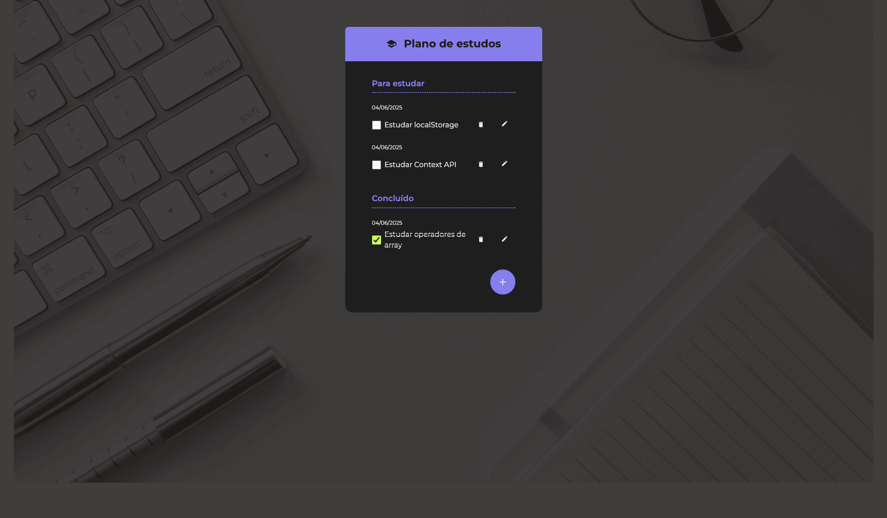

# ✅ Checklist de Estudos

App de checklist para organizar tarefas de estudo, desenvolvido com React 19 e Vite.



## 🔨 Funcionalidades

- Adicionar, editar e excluir tarefas
- Marcar tarefas como concluídas
- Organização em grupos: "Para estudar" e "Concluído"
- Persistência local com localStorage
- Modal (Dialog) para formulário de tarefas
- Empty state quando não há tarefas
- Botão flutuante (FAB) para adicionar novas tarefas

## 🛠️ Tecnologias

- **React 19** com hooks (`useState`, `useEffect`, `use`)
- **Context API** para gerenciamento de estado global (`ToDoProvider`)
- **Vite 6** como bundler
- **CSS Modules** para estilização por componente
- **ESLint** para linting

## 📁 Estrutura de Componentes

```
src/
├── App.jsx
├── main.jsx
├── index.css
└── components/
    ├── Button/
    ├── ChecklistsWrapper/
    ├── Container/
    ├── Dialog/
    ├── EmptyState/
    ├── FabButton/
    ├── Footer/
    ├── Formulario/
    ├── Header/
    ├── Heading/
    ├── SubHeading/
    ├── TextInput/
    ├── ToDoGroup/
    ├── ToDoItem/
    ├── ToDoList/
    ├── ToDoProvider/
    └── icons/
```

## 🚀 Como rodar

Pré-requisito: [Node.js](https://nodejs.org/) >= 22

```bash
# Instalar dependências
npm install

# Rodar em desenvolvimento
npm run dev
```

Acesse: [http://localhost:5173](http://localhost:5173)

## 📦 Scripts disponíveis

| Comando | Descrição |
|---------|-----------|
| `npm run dev` | Inicia o servidor de desenvolvimento |
| `npm run build` | Gera o build de produção |
| `npm run preview` | Pré-visualiza o build de produção |
| `npm run lint` | Executa o ESLint |
